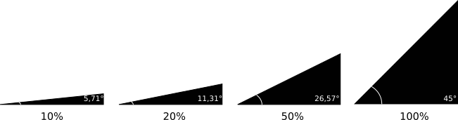

# DONESOL MOBILE

## Applications de saisie sur le terrain

Vous trouverez ici deux applications de saisie au format [Donesol3](https://dw3.gissol.fr/), réalisées dans le cadre du projet TI Dijon Métropole et conçues par Agaric-IG et Sol-Envie.

Ces applications permettent de saisir :

* des sondages pédologiques (échantillon)
* des profils pédologiques (fosses)

### Sondages pédologiques (échantillon)

Les critères suivants ont été respectés :

* utilisation du modèle de données Donesol3
* fonctionnement en mode déconnecté
* possibilité d'embarquer des fonds de plans
* possibilité d'intégrer des images / guides dans le formulaire

Cette application de saisie est utilisable :

* sur [QGis](https://qgis.org) : c'est la version qui est (a été) utilisée par Solenvie sur le terrain pendant la campagne du projet sur une tablette.
* sur [QField](https://qfield.org) sur smartphone. Cette version est une adaptation de la précédente. Elle n'a pas été testée en production.

Les données saisies sont stockées dans le fichier data.gpkg au format [**geopackage**](https://www.geopackage.org/)\*\* :\*\*

Elles sont stockées dans les tables

* profil (avec une extension)
* horizons

Les autres tables sont des références externes qui sont utilisées pour le remplissage des listes déroulantes.

### Profils pédologiques (fosses)

Les critères suivants ont été respectés :

* utilisation du modèle de données Donesol3
* fonctionnement en mode déconnecté
* possibilité d'embarquer des fonds de plans
* possibilité d'intégrer des images / guides dans le formulaire

Vous pouvez utiliser l'application :

* sur [QGis](https://qgis.org) : c'est la version qui est (a été) utilisée par Solenvie sur le terrain pendant la campagne du projet sur une tablette.
* sur [QField](https://qfield.org) sur smartphone. Cette version est une adaptation de la précédente. Elle n'a pas été testée en production.

Les données saisies sont stockées dans le fichier data.gpkg au format [**geopackage**](https://www.geopackage.org/)\*\* :\*\*

Elles sont stockées dans les tables

* fosses (avec une extension)
* horizons

Les autres tables sont des références externes qui sont utilisées pour le remplissage des listes déroulantes.

### Perspectives

Ces applications peuvent être améliorées sur plusieurs points :

*QGis*

* simplification des noms des tables dans le fichier geopackage (pour l'instant c'est un nommage généré par le plugin d'export pour qfield)
* succession de liste déroulante conditionnelles pour les longues listes de références externes (matériau parental, couleur codée munsel, ...)
* multiplier les onglets pour simplifier la taille des écrans de saisie
* affichage de menus que quand ils sont nécessaires
* rendre cliquables les triangles de texture
* rendre cliquable les pictos pour les éléments grossiers

*QField*

* meilleure prise en comtpe des schémas
* amélioration des écrans par rapport à la taille des appareils

Si vous souhaitez utiliser ces projets, merci de respecter la licence [CeCILLv2](https://cecill.info/licences.fr.html). Si vous souhaitez y contribuer, merci de nous contacter : contact@agaricig.com pour partager